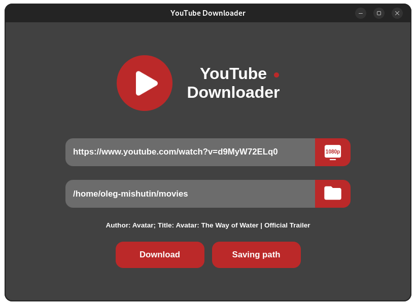
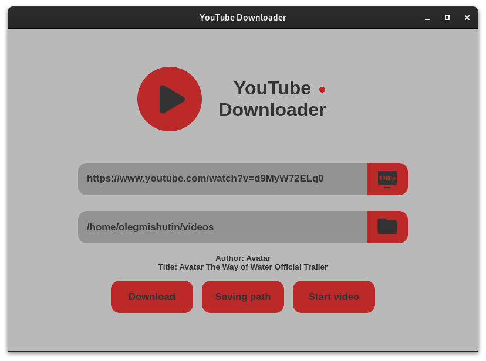

# YouTube Downloader

YouTube Downloader is a simple app that helps you download videos from YouTube in the highest resolution (up to 4k). The
app is available for Linux and Windows users. The only thing you need is a browser, without a browser the app will not
work.

## Interface

The interface is fully responsive, intuitive and supports light and dark theme.

## Launch

*Launch via Python*

1. download the archive of the **main** branch and unzip it.
3. open unziped folder in the console.
4. run the command `python main.py`.

*Launch on Windows*

1. switch the branch to **windows**.
2. download and unzip the archive.
3. open unziped folder.
4. run the `main.exe` file.

*Launch on Linux*

1. switch the branch to **linux**.
2. download and unzip the archive.
3. open unziped folder in the console.
4. run the command `./main`.

## How to use

To open YouTube:

1. Click on the app icon.

To download a video from YouTube:

When you first load the video, you will see the message
**"Please open https://www.google.com/device and input code ..."** in the console, open the link in the browser and
register the device. Without this, the app will not work properly.

1. enter the URL link of the video and the path to the folder where you want to save it.
2. click the download button and wait for the download to finish.

The video processing progress is displayed in the console. To stop downloading and processing video you need to close
the console, but then the app logic will not work. So make sure you want to download a big video before doing that.

To change theme color, click on the little button next to the app name.

## What was used in the development

* [Python3.9.16](https://www.python.org/downloads/release/python-3916/) (Windows version
  uses [Python3.9.13](https://www.python.org/downloads/release/python-3913/)) and the following libraries:
    * [Eel](https://github.com/python-eel/Eel) was used to implement the app and communication with the web
      interface.
    * [Pytube](https://github.com/pytube/pytube) was used for YouTube video download logic.
    * [Moviepy](https://github.com/Zulko/moviepy) was used to connect video and audio track.

* HTML for page markup.
* CSS for styling.
* JS for the logic of working with Python.

## Some info

Some videos cannot be downloaded in such a high format as presented on YouTube, it depends on the video.

At the moment, the app has a major disadvantage - it works in **one thread**. Keep this in mind when using the app.

If you have the dark theme extension enabled in the browser, then the app may have a slightly **different color tint**.

The **main** branch receives updates before all other branches. Updates for the **Linux** and **Windows** branches come
after a large number of changes in the **main** branch.