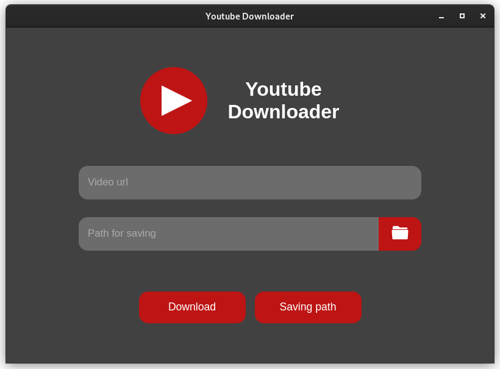

# Youtube Downloader

"Youtube Downloader" app is a small program with a simple interface that will help you to download videos from
youtube. The application was developed in the [Python3.9.16](https://www.python.org/) programming language using the
following libraries: [eel](https://github.com/python-eel/Eel), [pytube](https://github.com/pytube/pytube),
[moviepy](https://github.com/Zulko/moviepy). The nice feature of this app is cross-platform, it can be run on
Windows or Linux without any third party programs.

## Interface

The app interface is very simple. It was written in HTML, CSS and JS. Here is a preview.

## Launch

Main branch
> To run the main app code, download the archive of the **"main"** branch, unzip it, open the folder in the console
> and run the command `python3.9 -m main`. Python must also be installed on your computer with the libraries that are
> written above.

Windows branch
> To run the app on Windows, switch the branch to **"windows"**, download and unzip the archive, open the folder, then
> run the `main.exe` file.

Linux branch
> To run the app on Linux, switch the branch to **"linux"**, download and unzip the archive, then open the folder in the
> console and run the command `./main`.

## How to use

To download a video from YouTube you need to enter the URL link of the video and the path to the folder where you want
save it. Then click the download button and wait for the download to finish.

The video processing progress is displayed in the console. To stop downloading and processing video you need to close
the console, but then the app logic will not work. So make sure you want to download a big video before doing that.

## Some info

The **"main"** branch is the main branch, so updates for it will be released earlier. Updates of the remaining branches
will occur when there are many changes in the main branch.